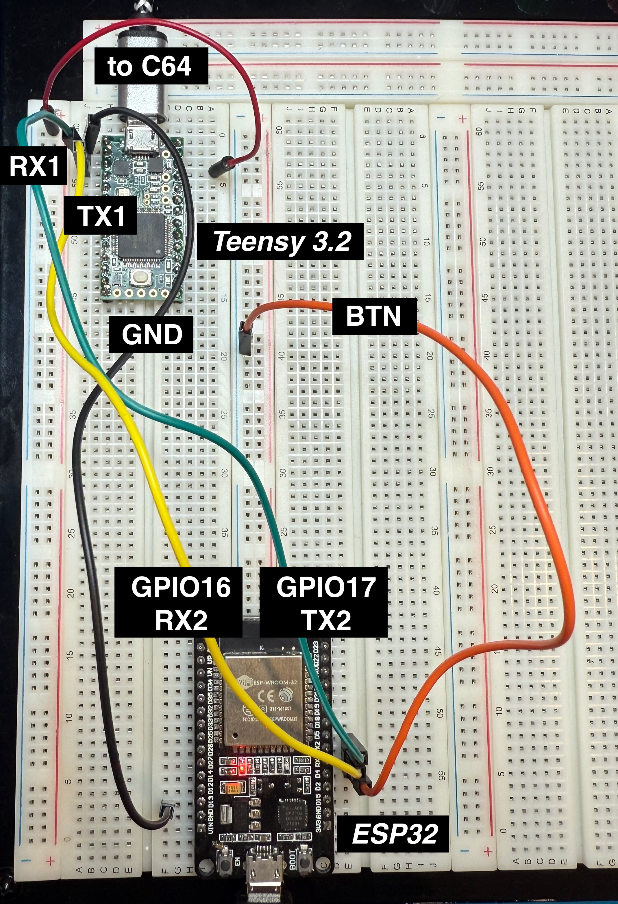
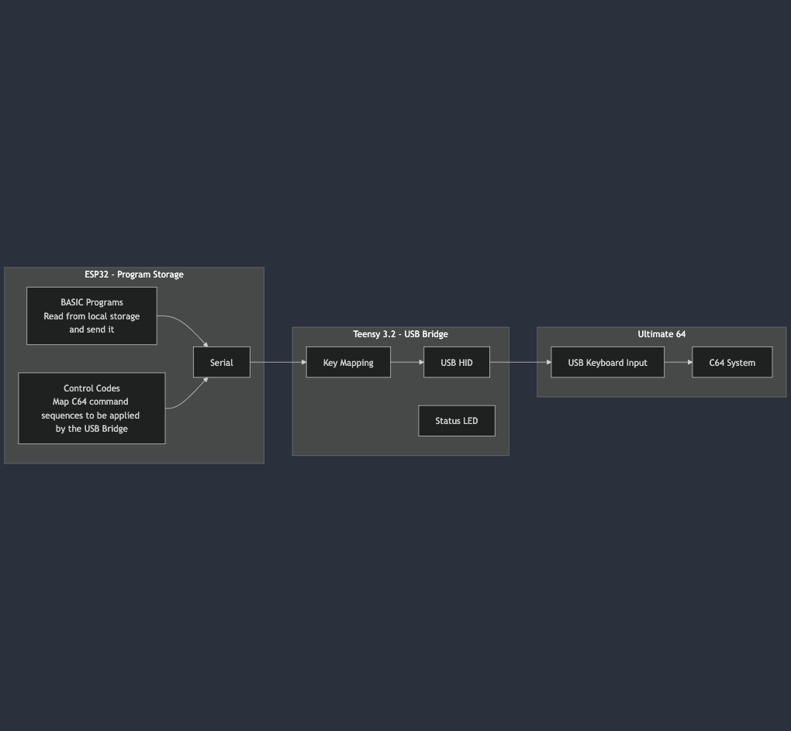
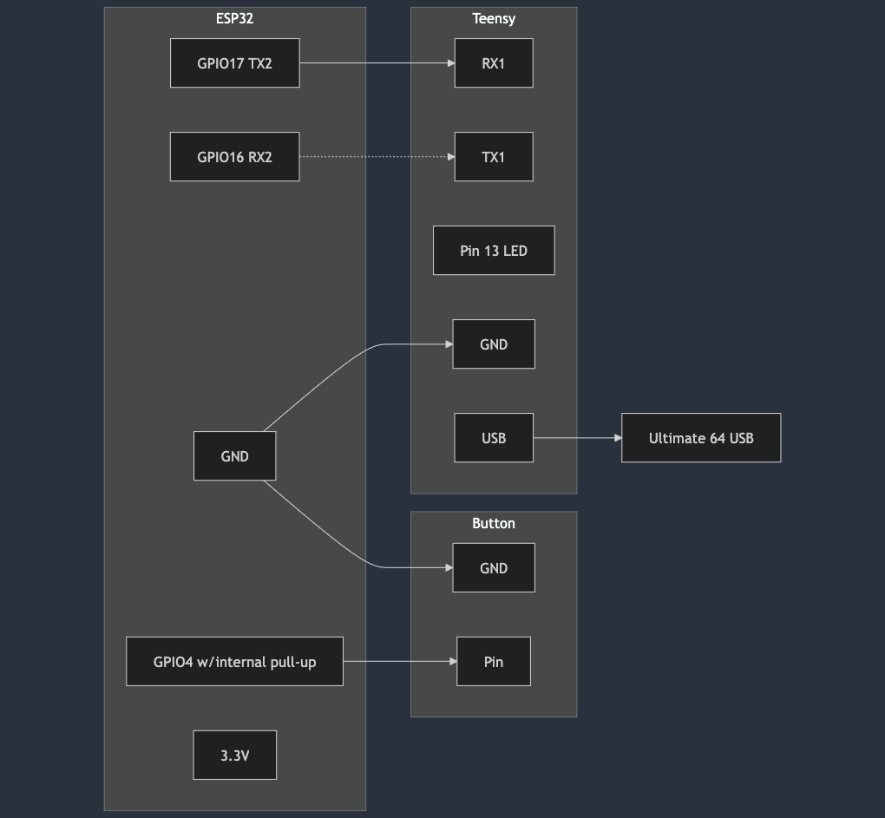

# Commodore 64 Auto-Typer (C64-AT)

A modern solution for automating keyboard input on the Ultimate 64, enabling programmatic control of a Commodore 64 through USB HID keyboard emulation.

## Overview

This project creates a bridge between modern microcontrollers and the Ultimate 64 (a modern FPGA-based Commodore 64 replacement) by emulating USB keyboard input. The system allows for automated typing of BASIC programs, control codes, and special key combinations.

For a detailed write-up and build instructions, visit my [blog post](ADD_YOUR_BLOG_URL).

## Project Demo


*Auto-typing the Dancing Mouse demo program*


*Hardware setup showing ESP32 and Teensy on a breadboard*

## Included Demo Programs

The project comes with several demo programs in the `esp32/basic` directory:

- **hello.bas**: Simple "Hello, World!" demonstration using color codes
- **mouse.bas**: Dancing mouse animation using custom characters and sound
- **maze.bas**: Interactive maze generator with F1/F3 key controls
- **bounce.bas**: Classic bouncing ball animation using sprites

Each demo showcases different aspects of the Commodore 64's capabilities and the auto-typer's features.

## System Architecture


*System architecture showing data flow between components*

## Wiring Diagram


*Physical connections between ESP32, Teensy, and Ultimate 64*

## Features

- Automatic typing of BASIC programs stored on the ESP32
- Support for all Commodore 64 control codes and special keys
- Status LED indication for operation feedback
- Button trigger for program execution
- Configurable typing speed and delays
- Support for:
  - Function keys (F1-F8)
  - Color codes
  - Cursor controls
  - RUN/STOP + RESTORE
  - Special key combinations

## Project Structure

- **/esp32**: MicroPython code for the ESP32
  - Program storage and processing
  - Commodore ASCII code generation
  - Serial communication with Teensy
  
- **/teensy**: Arduino code for the Teensy 3.2
  - USB HID keyboard emulation
  - Commodore to USB key code mapping
  - Status LED control

## Getting Started

1. Clone this repository
2. Follow setup instructions in the respective folders:
   - [ESP32 Setup](/esp32/README.md)
   - [Teensy Setup](/teensy/README.md)
3. Use the Makefile for common operations:
   ```bash
   make help           # Show available commands
   make esp32          # Deploy ESP32 code
   make teensy         # Deploy Teensy code
   ```

## Hardware Requirements

- ESP32 development board
- Teensy 3.2 board
- Ultimate 64 (Elite or standard version)
- Push button for trigger
- Connecting wires
- USB cable (for Teensy to Ultimate 64 connection)

## Usage

1. Connect the hardware according to the wiring diagram
2. Load your BASIC program into the ESP32's filesystem
3. Press the trigger button to start the automated typing sequence
4. The system will:
   - Send RUN/STOP + RESTORE
   - Type NEW and RETURN
   - Type your BASIC program
   - Type RUN and RETURN

## BASIC Program Special Commands

When writing BASIC programs for the system, you can use special tokens that will be converted to the appropriate Commodore 64 control codes:

### Function Keys
- `{f1}` through `{f8}` - Function keys F1-F8
- `{run}` - RUN/STOP key (equivalent to Escape)
- `{restore}` - RESTORE key (implemented as ESC+F12 for Ultimate 64)

### Color Commands
- `{black}` - Switch to black text (CTRL + 1)
- `{white}` - Switch to white text (CTRL + 2)
- `{red}` - Switch to red text (CTRL + 3)
- `{cyan}` - Switch to cyan text (CTRL + 4)
- `{purple}` - Switch to purple text (CTRL + 5)
- `{green}` - Switch to green text (CTRL + 6)
- `{blue}` - Switch to blue text (CTRL + 7)
- `{yellow}` - Switch to yellow text (CTRL + 8)
- `{orange}` - Switch to orange text (COMMODORE + 1)
- `{brown}` - Switch to brown text (COMMODORE + 2)
- `{light red}` - Switch to light red text (COMMODORE + 3)
- `{dark gray}` - Switch to dark gray text (COMMODORE + 4)
- `{medium gray}` - Switch to medium gray text (COMMODORE + 5)
- `{light green}` - Switch to light green text (COMMODORE + 6)
- `{light blue}` - Switch to light blue text (COMMODORE + 7)
- `{light gray}` - Switch to light gray text (COMMODORE + 8)

### Control Commands
- `{clear}` - Clear screen (SHIFT + CLR/HOME)
- `{home}` - Move cursor to home position (CLR/HOME)
- `{up}` - Cursor up
- `{down}` - Cursor down
- `{left}` - Cursor left
- `{right}` - Cursor right

### Example BASIC Program
```basic
10 print "{clear}{white}hello {light blue}world!"
20 print "{down}{red}this is in red"
30 print "{green}and this is green"
```

## Development

The project uses:
- PlatformIO for Teensy development
- MicroPython for ESP32 development
- Make for build automation

See the Makefile for available commands and build options.

## Contributing

Contributions are welcome! Please feel free to submit a Pull Request. For major changes, please open an issue first to discuss what you would like to change.

1. Fork the project
2. Create your feature branch (`git checkout -b feature/AmazingFeature`)
3. Commit your changes (`git commit -m 'Add some AmazingFeature'`)
4. Push to the branch (`git push origin feature/AmazingFeature`)
5. Open a Pull Request

## License

MIT License

Copyright (c) 2025 Carl Edwards

Permission is hereby granted, free of charge, to any person obtaining a copy
of this software and associated documentation files (the "Software"), to deal
in the Software without restriction, including without limitation the rights
to use, copy, modify, merge, publish, distribute, sublicense, and/or sell
copies of the Software, and to permit persons to whom the Software is
furnished to do so, subject to the following conditions:

The above copyright notice and this permission notice shall be included in all
copies or substantial portions of the Software.

THE SOFTWARE IS PROVIDED "AS IS", WITHOUT WARRANTY OF ANY KIND, EXPRESS OR
IMPLIED, INCLUDING BUT NOT LIMITED TO THE WARRANTIES OF MERCHANTABILITY,
FITNESS FOR A PARTICULAR PURPOSE AND NONINFRINGEMENT. IN NO EVENT SHALL THE
AUTHORS OR COPYRIGHT HOLDERS BE LIABLE FOR ANY CLAIM, DAMAGES OR OTHER
LIABILITY, WHETHER IN AN ACTION OF CONTRACT, TORT OR OTHERWISE, ARISING FROM,
OUT OF OR IN CONNECTION WITH THE SOFTWARE OR THE USE OR OTHER DEALINGS IN THE
SOFTWARE.

## Acknowledgments

- [Ultimate 64](https://ultimate64.com/Ultimate-64-Elite) - Modern FPGA-based Commodore 64
- [Teensy](https://www.pjrc.com/teensy/) - USB HID implementation
- [MicroPython](https://micropython.org/) - Python for microcontrollers
- Commodore 64 community for inspiration and technical documentation 